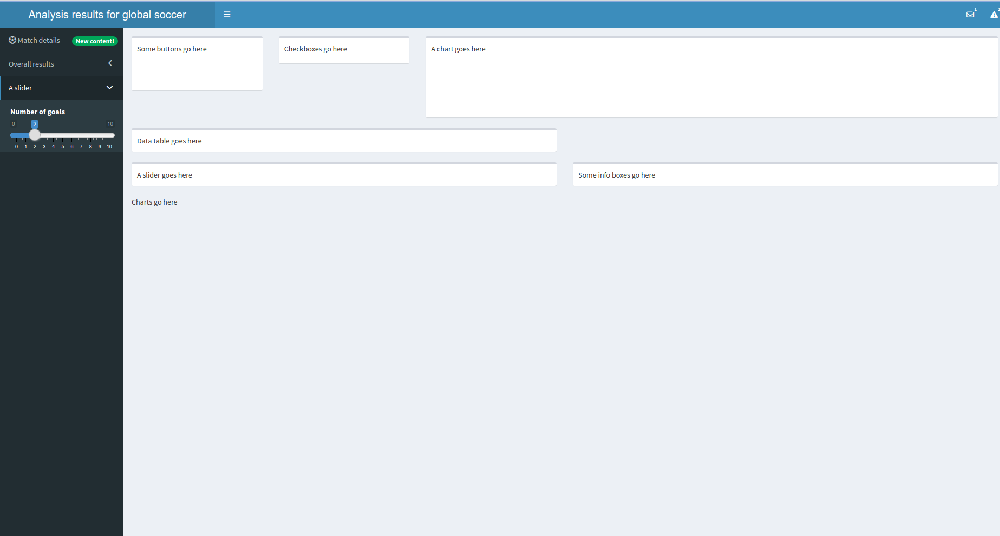

# *Your First Shiny Dashboard: A Beginner’s Guide to shinydashboard in R*

## **Introduction:**  
In today’s data-driven world, creating visually appealing and interactive dashboards is a highly sought-after skill. While paid tools like PowerBI and Tableau offer robust solutions, they often come with steep learning curves and licensing costs that might not be feasible for everyone. This is where **R** and its versatile ecosystem shine, particularly with the **shinydashboard** package.

**shinydashboard** is an extension of R’s popular **Shiny** framework, designed to help you create professional dashboards with minimal effort. Unlike other tools, shinydashboard allows you to build fully functional dashboards using only R code—no need to dive into additional programming languages or expensive software suites. The package streamlines the layout and design of dashboards, offering pre-built components like menus, boxes, and tabbed content, so you can focus on showcasing your data and insights.

Advantages of using shinydashboard over paid tools include:  
- **Cost:** Completely free and open-source, eliminating the need for licensing fees.  
- **Flexibility:** Seamlessly integrates with the vast R ecosystem, allowing you to leverage R's powerful data manipulation and visualization capabilities.  
- **Customization:** Unlike fixed templates in paid tools, you can fully customize the functionality and aesthetics of your dashboard with R and CSS.  
- **Portability:** Dashboards can be hosted on your own server, shared through Shinyapps.io, or embedded in existing websites.  
- **Transparency:** Being open-source, you have full control over your code, ensuring reproducibility and transparency in your work.  

This guide will walk you through the steps to build your very first dashboard using shinydashboard. Whether you’re an analyst, data scientist, or curious beginner, you’ll see just how easy and rewarding it is to create a dashboard that’s not only functional but also visually impressive—all without spending a dime.


## **Section 1: Understanding the Overall Structure of a shinydashboard Application**  


Building a dashboard with **shinydashboard** begins with understanding its fundamental structure. Like all Shiny applications, a shinydashboard app consists of two main components: the **UI (User Interface)** and the **server** logic. These components work together to define the layout, appearance, and functionality of your dashboard. Let’s break down the code step by step to see how it all comes together.  

### Code Overview  
Here’s a simple script that serves as the skeleton for a shinydashboard app:  

```R
library(shinydashboard)
library(shiny)

header <- dashboardHeader(title = "My first dashboard")

sidebar <- dashboardSidebar()

body <- dashboardBody()

ui <- dashboardPage(header, sidebar, body)

server <- function(input, output) {
  
}

shinyApp(ui, server)
```  

### Explanation  

#### 1. **Loading Required Libraries**  
```R
library(shinydashboard)
library(shiny)
```  
The **shinydashboard** package is an extension of the **shiny** package, so both libraries are essential. The `shinydashboard` library provides prebuilt components and layouts specifically designed for dashboards, while `shiny` handles the core functionality of the app.  

#### 2. **Defining the Dashboard Components**  
A shinydashboard app is structured around three main layout components:  
- **Header:** Defines the top bar of the dashboard.  
- **Sidebar:** Contains navigation elements like menus and links.  
- **Body:** The main area where the content (e.g., plots, tables, text) is displayed.  

```R
header <- dashboardHeader(title = "My first dashboard")
```  
The `dashboardHeader()` function creates the header of the dashboard. Here, we’ve specified a title, “My first dashboard,” which will appear prominently in the header.  

```R
sidebar <- dashboardSidebar()
```  
The `dashboardSidebar()` function defines the sidebar. In this example, it’s currently empty, but later, you can populate it with navigation menus, input controls, or other elements.  

```R
body <- dashboardBody()
```  
The `dashboardBody()` function specifies the main content area. Like the sidebar, it’s currently empty, but you’ll soon add widgets, plots, and more to make your dashboard interactive and informative.  

#### 3. **Assembling the UI**  
```R
ui <- dashboardPage(header, sidebar, body)
```  
The `dashboardPage()` function combines the header, sidebar, and body into a cohesive layout. This creates the UI (User Interface) for the dashboard.  

#### 4. **Defining the Server Logic**  
```R
server <- function(input, output) {
  
}
```  
The `server` function is where you define the logic for your dashboard. It connects inputs (like dropdowns or sliders) to outputs (like plots or tables). In this basic example, the server is empty, as there’s no interactive functionality yet.  

#### 5. **Running the App**  
```R
shinyApp(ui, server)
```  
The `shinyApp()` function takes the `ui` and `server` components and launches the app. Running this script will generate a simple, empty dashboard with a header, sidebar, and body.  

---

This structure serves as the foundation for any shinydashboard application. By filling in the sidebar and body with menus, inputs, and outputs, and defining interactions in the server, you’ll transform this skeleton into a fully functional and visually appealing dashboard.  

In the next section, we’ll explore how to customize the sidebar and add interactive elements to make the dashboard come alive!  


## **Section 2: Customizing the Header and Sidebar in shinydashboard**  


Once the foundational structure of a **shinydashboard** application is in place, you can begin customizing its components to fit your needs. Two of the most visually prominent and interactive elements of a dashboard are the **header** and **sidebar**. This section explores various options available for these components, using the [`2_header_and_sidebar.R`](https://github.com/joshafouda/tuto-shinydashboard/blob/main/2_header_and_sidebar.R) script as a guide.

---

### **1. Customizing the Header**  
The **header** is the top bar of the dashboard and serves as a space for titles, branding, and notifications.  

#### Key Features:  
1. **Title and Width**  
   - The `title` argument sets the text displayed in the header.  
   - `titleWidth` adjusts the space allocated for the title, useful for longer text like "Analysis for global soccer tournament."  

2. **Dropdown Menus**  
   - The `dropdownMenu()` function adds interactive dropdown menus for **messages**, **notifications**, or **tasks**.  
   - Each dropdown menu can include specific items:
     - **`messageItem`**: Displays a message with optional metadata like time and an icon.  
     - **`notificationItem`**: Adds a simple notification to the dropdown.  
     - **`taskItem`**: Shows a progress indicator with a value and color to represent task completion.  
   - Here, the header includes two dropdown menus: one for messages and one for notifications.  

---

### **2. Configuring the Sidebar**  
The **sidebar** is a vertical navigation panel where you can add menus, inputs, and other controls.  

#### Key Features:  
1. **Width and Visibility**  
   - `width`: Sets the sidebar’s width. In this example, it’s expanded to 400 pixels.  
   - `disable`: Can be set to `TRUE` to hide the sidebar entirely.  

2. **Sidebar Menu**  
   - `sidebarMenu()` organizes navigation items into a hierarchy.  
   - The `id` parameter allows the app to track which menu item is selected.  

3. **Menu Items**  
   - `menuItem()`: Creates navigation links. Each item can have:  
     - **`tabName`**: Links the menu item to a specific tab in the dashboard body.  
     - **`icon`**: Adds an icon (using Font Awesome) to the menu item for better visualization.  
     - **Badges**: `badgeLabel` and `badgeColor` add a label with a customizable color to highlight menu items (e.g., "New content!").  

4. **Inputs in the Sidebar**  
   - The sidebar can include interactive inputs. For example, `checkboxGroupInput()` adds checkboxes for selecting days of the week.  

5. **Submenus**  
   - `menuSubItem()`: Creates nested items under a main menu item. For instance, the “Overall results” menu has two subtabs: “Charts” and “Data table.”  

---

### **Summary**  
This section of the dashboard showcases how flexible and customizable the header and sidebar are in shinydashboard. The header can serve as a hub for messages, notifications, and branding, while the sidebar is perfect for organizing navigation and controls. Together, these elements enhance user experience and make your dashboard intuitive and visually appealing.

In the next section, we’ll populate the **body** with content, such as plots, tables, and interactive elements, to bring the dashboard to life!  


## **Section 3: Exploring the Body Layout Options in shinydashboard**  



The **body** of a shinydashboard application is where the main content lives. This is the space for displaying tables, charts, inputs, and other interactive elements. The layout in the body is highly customizable, thanks to **fluidRow** and **box** functions, which allow you to arrange components flexibly. Let’s break down the code in the `3_body.R` script to understand how to structure and populate the body.  

---

### **1. Structuring the Body with fluidRow and box**  
The `dashboardBody()` function is used to define the body’s content. Inside it, we use `fluidRow()` to organize elements into rows and `box()` to group related components.

#### Example: Adding Boxes to Rows  
```R
body <- dashboardBody(
  # Add three boxes with widths 2, 2, and 8
  fluidRow(
    box("Some buttons go here", width = 2, height = 100), 
    box("Checkboxes go here", width = 2, height = 50),
    box("A chart goes here", width = 8, height = 150)
  ),
  # Add one box that fills the entire row
  fluidRow(
    box("Data table goes here", width = 12, height = 200)
  ),
  # Add a third row containing two boxes with equal widths
  fluidRow(
    box("A slider goes here", width = 6), 
    box("Some info boxes go here", width = 6)
  )
)
```

#### Key Features:  
1. **fluidRow()**  
   - Groups elements into horizontal rows. Each row contains one or more boxes.  
   - The width of a row is divided into 12 columns, so each box’s `width` is specified relative to this scale.  

2. **box()**  
   - Creates a container for content. Boxes are commonly used for widgets (e.g., sliders, buttons), visualizations, or text.  
   - Arguments:  
     - `width`: Defines the box's horizontal space (out of 12).  
     - `height`: Adjusts the vertical height of the box.  

---

### **2. Adding Tabs for Navigation**  
The body can also include **tabs** for organizing content into separate pages. Tabs are created using `tabItems()` and `tabItem()`.  

#### Example: Adding Tabs  
```R
tabItems(
  tabItem("matches", "Match information goes here"),
  tabItem("datatable", "Data table goes here"),
  tabItem("charts", "Charts go here")
)
```

#### Key Features:  
- **tabItems()**: Groups all `tabItem()` components.  
- **tabItem(tabName)**: Defines the content of a specific tab. The `tabName` must match the `tabName` specified in the sidebar’s `menuItem()` to ensure navigation works correctly.  
- Tabs allow users to switch between different sections of the dashboard, such as "Match details," "Data table," and "Charts."  

---

### **3. Combining Rows, Boxes, and Tabs**  
The layout of this body combines rows with various boxes and tabs to organize the content effectively:  

1. **First Row**:  
   - Contains three boxes for buttons, checkboxes, and a chart.  
   - The chart box takes up most of the space (`width = 8`), emphasizing its importance.  

2. **Second Row**:  
   - Features a single box spanning the full width (`width = 12`) for displaying a data table.  

3. **Third Row**:  
   - Includes two equally spaced boxes (`width = 6` each) for sliders and information boxes.  

4. **Tab Content**:  
   - Each tab page, like "matches," "datatable," and "charts," has its own dedicated content area. These areas will display content such as match details, data tables, and visualizations, linked to the sidebar menu.  

---

### **Summary**  
The **body** of a shinydashboard application provides a flexible canvas for organizing content. By using rows, boxes, and tabs, you can create an intuitive and visually balanced layout for your dashboard. This design ensures that your audience can easily navigate through the app and access the information they need.  

In the next section, we’ll explore how to make the dashboard interactive by connecting the body’s content to user inputs and outputs using Shiny’s server logic!  


## **Section 4: Building a Sales Dashboard in Practice**  


Now that you’re familiar with the structure and customization options in shinydashboard, it’s time to put everything into practice by building a **Sales Dashboard**. This dashboard will visualize key sales metrics, identify top-performing products, and provide insights into average sales and market share.  

---

### **Overview of the Sales Dashboard**  

The Sales Dashboard includes:  
- **Header**: Displays the title, "Sales Dashboard."  
- **Sidebar**: Provides a navigation menu with a single "Overview" tab.  
- **Body**: Contains three main sections:  
  1. **Key Metrics**: Value boxes showing total sales, the top product, and the product with the highest revenue.  
  2. **Visualizations**: A histogram of sales quantities and a pie chart of market share.  
  3. **Interactive Analysis**: A dropdown to select a product and view its average sales trend.  

---

### **Code Walkthrough**  

#### **1. Setting Up the User Interface**  

The `header`, `sidebar`, and `body` are defined using `dashboardHeader()`, `dashboardSidebar()`, and `dashboardBody()`.

##### **Header**  
```R
header <- dashboardHeader(title = "Sales Dashboard")
```
- **Title**: Displays "Sales Dashboard" prominently at the top.

##### **Sidebar**  
```R
sidebar <- dashboardSidebar(
  sidebarMenu(
    menuItem("Overview", tabName = "overview", icon = icon("dashboard"))
  )
)
```
- **Menu**: Includes a single tab named "Overview," linked to the body’s `overview` tab.  

##### **Body**  
The body is where the dashboard's main content is displayed.  

```R
body <- dashboardBody(
  tabItems(
    tabItem(tabName = "overview",
            fluidRow(
              valueBoxOutput("total_sales", width = 4),
              valueBoxOutput("top_product", width = 4),
              valueBoxOutput("top_revenue_product", width = 4)
            ),
            fluidRow(
              box(title = "Quantités vendues", status = "primary", solidHeader = TRUE,
                  plotOutput("histogram"), width = 12)
            ),
            fluidRow(
              box(title = "Parts de marché", status = "primary", solidHeader = TRUE,
                  plotOutput("pie_chart"), width = 6),
              box(title = "Ventes moyennes", status = "primary", solidHeader = TRUE,
                  selectInput("product", "Choisissez un produit", choices = unique(sales$product)),
                  plotOutput("avg_sales_curve"), width = 6)
            )
    )
  )
)
```

- **Key Metrics Section**  
  - `valueBoxOutput()` creates boxes for total sales, top product, and top revenue product.  

- **Visualization Section**  
  - `plotOutput()` is used to display two visualizations:  
    - A histogram of sales quantities in a full-width box (`width = 12`).  
    - A pie chart showing market share in a half-width box (`width = 6`).  

- **Interactive Analysis Section**  
  - A dropdown menu (`selectInput()`) allows users to select a product.  
  - The corresponding average sales curve is displayed in the adjacent box.

---

#### **2. Defining the Server Logic**  

The `server` function connects the UI elements to their respective data and visualizations.  

```R
server <- function(input, output) {
  output$total_sales <- renderValueBox({
    valueBox(
      total_sales_fn(), 
      "Total Sales", 
      icon = icon("dollar-sign"), 
      color = "green"
    )
  })
  
  output$top_product <- renderValueBox({
    valueBox(
      top_product_fn(), 
      "Top Product", 
      icon = icon("trophy"), 
      color = "blue"
    )
  })
  
  output$top_revenue_product <- renderValueBox({
    valueBox(
      top_revenue_product_value_fn(), 
      "Top Revenue Product", 
      icon = icon("chart-line"), 
      color = "purple"
    )
  })
  
  output$histogram <- renderPlot({
    plot_histogram()
  })
  
  output$pie_chart <- renderPlot({
    plot_pie_chart()
  })
  
  output$avg_sales_curve <- renderPlot({
    plot_avg_sales_curve(input$product)
  })
}
```

- **Metrics Calculation**:  
  - Functions like `total_sales_fn()`, `top_product_fn()`, and `top_revenue_product_value_fn()` compute key metrics.  

- **Visualizations**:  
  - Functions like `plot_histogram()` and `plot_pie_chart()` generate plots.  
  - The selected product from `selectInput()` is used in `plot_avg_sales_curve(input$product)` to render the average sales trend.

---

### **3. Best Practices: Using a Utility Script**  

The sales dashboard depends on data and reusable functions for calculations and visualizations. These should be stored in a separate script (e.g., `utils.R`) for clarity and maintainability.  

#### Why Use a Utility Script?  
1. **Code Organization**: Keeps the app script focused on layout and logic.  
2. **Reusability**: Functions and data can be reused across multiple dashboards or projects.  
3. **Debugging**: Easier to isolate and debug issues related to data or calculations.  

---

### **Final Thoughts**  

By following these steps, you’ve built a functional and visually appealing sales dashboard. Using shinydashboard and Shiny’s flexibility, you can expand this template to include more advanced analyses and visualizations, creating dashboards that cater to your specific needs!

## **Conclusion**  

Building a dashboard with **shinydashboard** is a straightforward and rewarding process. With just a basic understanding of R and Shiny, you can create powerful, interactive dashboards that effectively communicate your data insights. Whether you're showcasing key metrics, visualizing trends, or providing interactive analysis, shinydashboard offers the tools and flexibility to bring your vision to life.  

For those looking to enhance their dashboards further, consider integrating libraries like **plotly** to create dynamic and interactive graphs that elevate the user experience. The possibilities are endless when combining R's capabilities with your creativity.  

Thank you for joining me on this journey to building your first dashboard. I hope this guide inspires you to create dashboards that are as functional as they are visually appealing.

As a passionate **Data Application Developer**, I am always excited to collaborate on new projects! If you have a data application project in mind and need help transforming your data into meaningful insights that drive business growth, I would love to work with you.  

Let’s discuss how I can help bring your vision to life with R Shiny. Feel free to schedule a meeting with me via this link: [Josué (Joshua) Afouda](https://calendly.com/afouda-josue). Together, we can turn your data into a powerful tool for success! 

If you enjoyed this article, feel free to follow me on Medium at [@afouda.josue](https://medium.com/@afouda.josue), on Linkedin at [@Josué A.](https://www.linkedin.com/in/josu%C3%A9-afouda/) and on YouTube at [J.A DATATECH CONSULTING](https://www.youtube.com/c/JADATATECHCONSULTING) for more tutorials, tips, and insights into R, Shiny, and data visualization. Let's continue learning and growing together!

If you'd like to explore the full code and try it out for yourself, visit the GitHub repository here: [tuto-shinydashboard](https://github.com/joshafouda/tuto-shinydashboard/tree/main). 